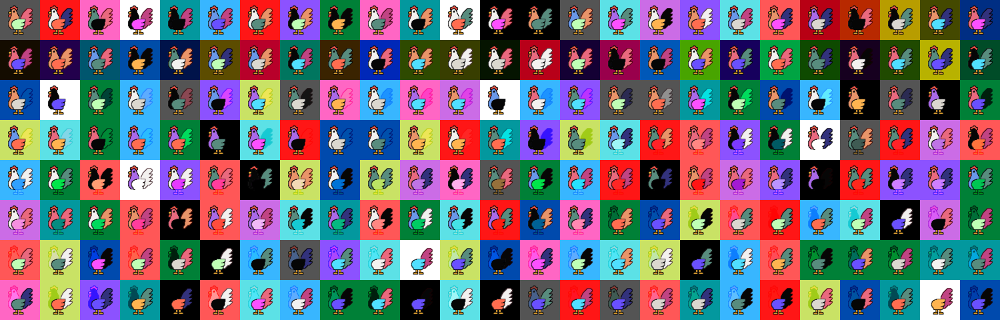

# KrytpoCamp 期末專案 Rookies NFT Collections




* [Opensea Official Website](https://testnets.opensea.io/collection/rookiesnftcollection)
---

## 四份合約

1. mint NFT - 大再
    - 盲盒機制、白名單機制、兩階段發售、空投機制
1. 戰鬥場
    - Kyle
1. 配對生育場
    - 英宗
1. 產蛋場
    - Marco

---

## 前端頁面

1. mint
    - 喬瑟夫
1. 戰鬥場
    - 喬瑟夫
1. 配對生育場
    - 喬瑟夫
1. 產蛋場
    - 喬瑟夫

---

## scaffold (腳手架)

喬瑟夫

## 專案架構

```bash
packages/vite-app-ts/ 前端專案
packages/hardhat-ts/ solidity 專案
```

## 開始專案

1. 先到 hardhat-ts 專案下,建立一個 .env 檔
   放置以下資訊

```env
REACT_APP_PROVIDER=96d856dd85f34d76a3c4ab39fccafe9a
ACCOUNT_PRIVATE_KEY= <錢包地址>
```

2. install your dependencies

    ```bash
    yarn install or npm install
    ```

3. start a hardhat node

    ```bash
    yarn chain or npm run chain
    ```

4. run the app, `open a new command prompt`

    ```bash
    # build hardhat & external contracts types
    yarn contracts:build or npm run contracts:build
    # deploy your hardhat contracts
    yarn deploy or npm run deploy
    # start vite
    yarn start or npm run start
    ```
    
 ## How to mint (Rookies.sol)
 * add to whitelist ```function addToAllowList(address[] calldata addresses)```
 * check mint status ```_isPreSaleActive, _isPublicSaleActive```
 * mint ```function mint_presale(uint8 NUM_TOKENS_MINT), function mint_public(uint8 NUM_TOKENS_MINT)```
 * Etherscan合約地址[Rookies.sol](https://rinkeby.etherscan.io/address/0x01d5b5044c5c6a97e071c5753fb7b6d40949cc06#code)

 ## Why ERC721A
 * 節省mint gas fee，特別是針對批次mint
 * 優化 1 - Removing duplicate storage from OpenZeppelin’s (OZ) ERC721Enumerable
 * 優化 2 - updating the owner’s balance once per batch mint request, instead of per minted NFT 
 * 優化 3 - updating the owner data once per batch mint request, instead of per minted NFT
 * 實作參考資料[Azuki ERC721A](https://www.azuki.com/erc721a?fbclid=IwAR0bYh7Ehls9hilQxVLl6h4AbqQNWng0N2o6UdOCpi4BRjm9609bGTKafqY)

## How to stake
* fisrtly, approve NFT to "TestStaking" contract
* secondly, stake NFT, then "TestStaking" contract will be the owner of this NFT
* thirdly, reward points increase automaticly
* finally, unstake NFT, NFT will be return to staker, and get reward


## License

This project is licensed under the [MIT license](LICENSE).
